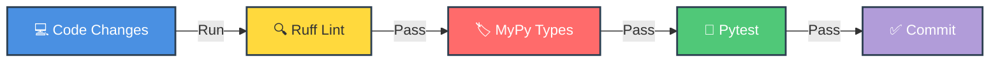
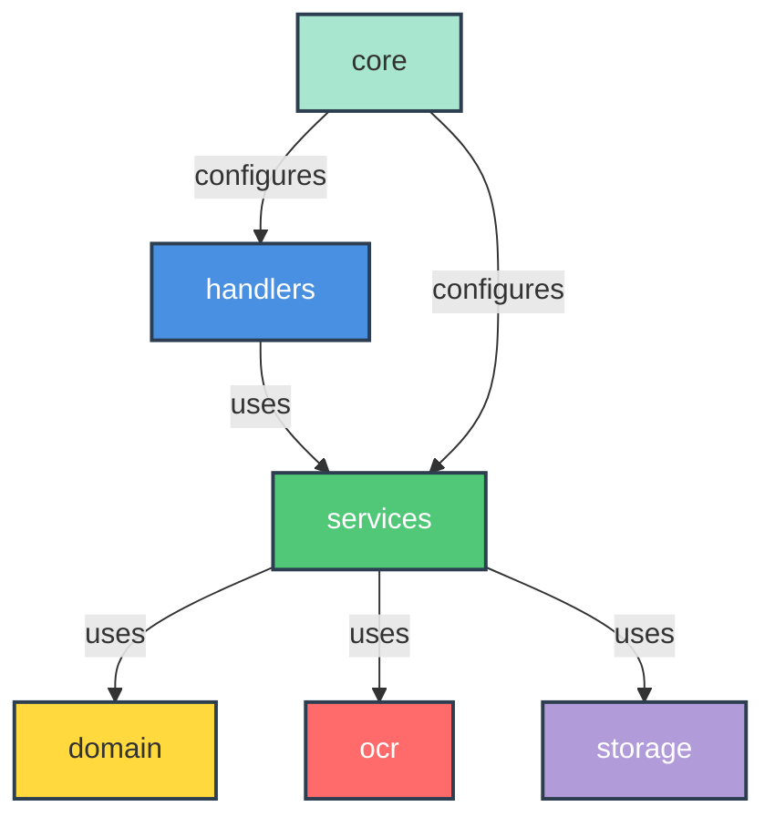

<div align="center">

<p align="center">
  
</p>

[](https://github.com/astral-sh/ruff)
[](https://docs.pytest.org/)
[](http://makeapullrequest.com)

</div>

---

## 📖 Overview

This document describes how to work with the codebase as a developer.

## 💻 Development Environment

> [!TIP]
> Follow these steps to set up your local development environment

<details>
<summary><b>🚀 Quick Setup Guide</b></summary>

### 1️⃣ Clone the repository

```powershell
git clone https://github.com/AmaLS367/InvoiceFlowBot.git
cd InvoiceFlowBot
```

### 2️⃣ Create and activate virtual environment

```powershell
python -m venv .venv
.\.venv\Scripts\Activate.ps1
```

### 3️⃣ Install dependencies in editable mode with dev extras

```powershell
python -m pip install -e .[dev]
```

> [!NOTE]
> This installs all development tools: pytest, ruff, mypy, pre-commit, bandit

</details>

## 🧪 Running Tests and Checks

> [!IMPORTANT]
> Always run these checks before committing code!

<div align="center">



</div>

### ⚡ Quick Check Commands

```powershell
# 🔍 Lint check
python -m ruff check .

# 🏷️ Type check
python -m mypy backend/

# 🧪 Run tests
python -m pytest
```

| Tool | Purpose | Config |
|------|---------|--------|
| 🔍 **ruff** | Linting & formatting | `pyproject.toml` |
| 🏷️ **mypy** | Type checking | `pyproject.toml` |
| 🧪 **pytest** | Unit & integration tests | `pyproject.toml` |
| 📊 **coverage** | Code coverage | `pyproject.toml` |

> [!NOTE]
> Unit tests and integration tests live under the `tests/` package.

## 🎣 Pre-commit Hooks

<div align="center">


</div>

This project uses `pre-commit` for automated local checks:

<table align="center">
<tr>
<td align="center">

<br/>
<b>🔍 Ruff</b>
<br/>
<sub>Lint & Format</sub>
</td>
<td align="center">

<br/>
<b>🏷️ MyPy</b>
<br/>
<sub>Type Checking</sub>
</td>
<td align="center">

<br/>
<b>🔒 Bandit</b>
<br/>
<sub>Security Checks</sub>
</td>
</tr>
</table>

### 🔧 Install and run hooks

```powershell
# Install hooks
pre-commit install

# Run on all files
pre-commit run --all-files
```

> [!NOTE]
> CI will automatically run `pre-commit` on every push and pull request.

## 📜 Coding Guidelines

> [!IMPORTANT]
> Follow these principles to maintain code quality

### 🏗️ Architecture Principles



### ✅ Best Practices

| Rule | Description | Why |
|------|-------------|-----|
| 🐍 **Python 3.11+** | Target modern Python | New features & performance |
| 🏛️ **Layer Separation** | `domain` → `services` → `handlers` | Clean architecture |
| 🧠 **Business Logic** | Keep in `services` & `domain` | Not in handlers |
| ⚡ **Async I/O** | For network & database | Better performance |
| 🧪 **Test Coverage** | For non-trivial changes | Prevent regressions |

<details>
<summary><b>📁 Project Structure</b></summary>

```
InvoiceFlowBot/
├── backend/
│   ├── 🎯 domain/      # Business entities
│   ├── ⚙️ services/    # Business logic
│   ├── 🔍 ocr/         # OCR providers
│   ├── 💾 storage/     # Database layer
│   ├── 🤖 handlers/    # Telegram handlers
│   └── 🔧 core/        # Configuration & DI
```

</details>

## 📚 Documentation

> [!TIP]
> Keep documentation up-to-date with your changes!

### 🏗️ Architecture & Design

<table>
<tr>
<td width="50%">

**📊 Architecture Docs**
- `docs/en/architecture.md`
- `docs/ru/architecture.md`

High-level system diagrams and component interactions

</td>
<td width="50%">

**📋 ADR (Architecture Decision Records)**
- `docs/adr/`

Documented decisions for key technology choices

</td>
</tr>
</table>

### ✍️ When to Update Docs

| Change Type | Update |
|-------------|--------|
| 🔧 Configuration | `docs/*/config.md` |
| 🐳 Deployment | `docs/*/setup-*.md` |
| 🏗️ Architecture | `docs/*/architecture.md` |
| ⚙️ Features | `docs/*/usage.md` |

---

<div align="center">

## 🤝 Thank You for Contributing!

<p align="center">
  
</p>


**Questions? Open an issue or discussion!** 💬

</div>
