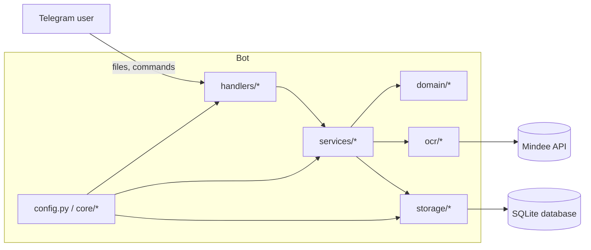
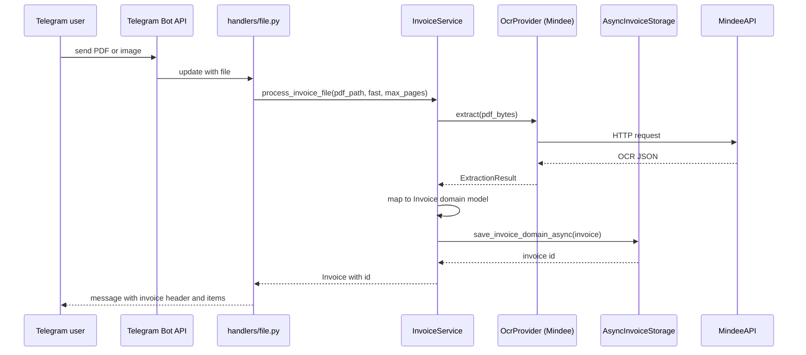

  

## 📋 About

This document describes the high level architecture of InvoiceFlowBot.

## 📦 Layers

The project is split into several layers:

- **domain** - pure domain model for invoices and drafts.

- **services** - business logic that orchestrates domain, OCR and storage.

- **ocr** - OCR engine and providers (Mindee), responsible for turning files into structured data.

- **storage** - async storage layer on top of SQLite and Alembic migrations.

- **handlers** - Telegram entrypoint implemented with aiogram 3.

- **core** - configuration and dependency injection container.

## High level component diagram

## Invoice processing flow

