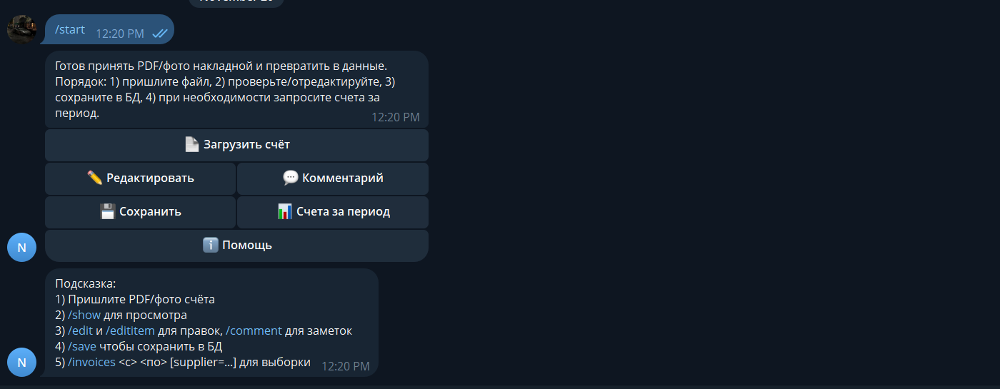
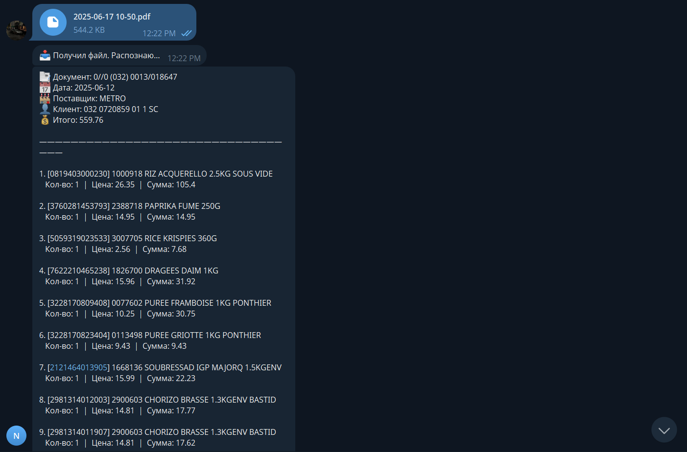
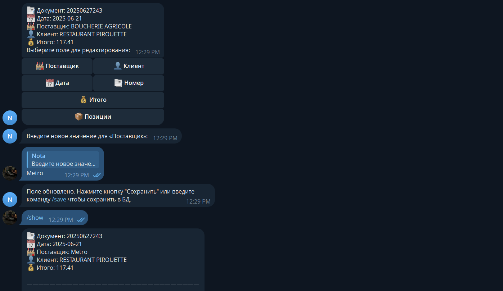
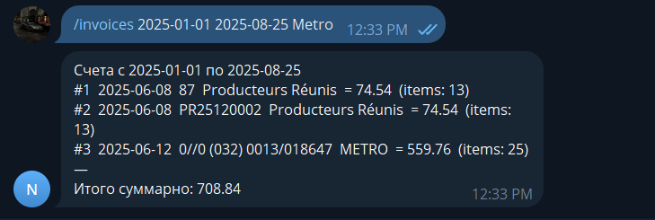

# Bot screenshots

This gallery illustrates the full cycle: starting the chat, processing an invoice, editing data, and querying saved results.

## Start screen and menu

Users run `/start`, see the inline keyboard, and pick the next action.

## Recognizing PDFs or photos

The bot uploads the file to Mindee and presents the extracted fields back in chat.

## Editing invoice data

Commands and buttons let you adjust header fields, line items, or add comments before saving.

## Invoices by period with totals

`/invoices` produces a summary list for the selected period plus the aggregated amount.

