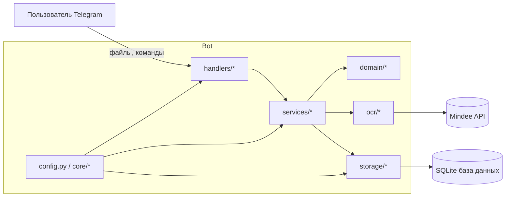
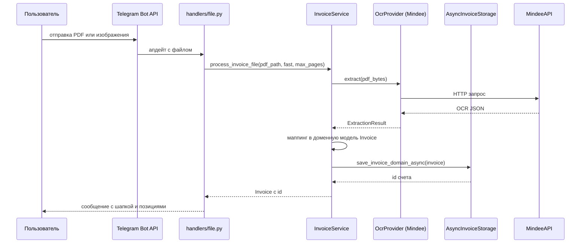

# Архитектура

Этот документ описывает высокоуровневую архитектуру InvoiceFlowBot.

## Слои проекта

Проект разделен на несколько слоев:

- **domain** - чистая доменная модель счетов и черновиков.

- **services** - бизнес логика, которая связывает домен, OCR и хранилище.

- **ocr** - движок OCR и провайдеры (Mindee), отвечают за преобразование файлов в структурированные данные.

- **storage** - асинхронный слой поверх SQLite с миграциями Alembic.

- **handlers** - входной слой Telegram на базе aiogram 3.

- **core** - конфигурация и контейнер зависимостей.

## Общая схема компонентов

## Поток обработки инвойса

