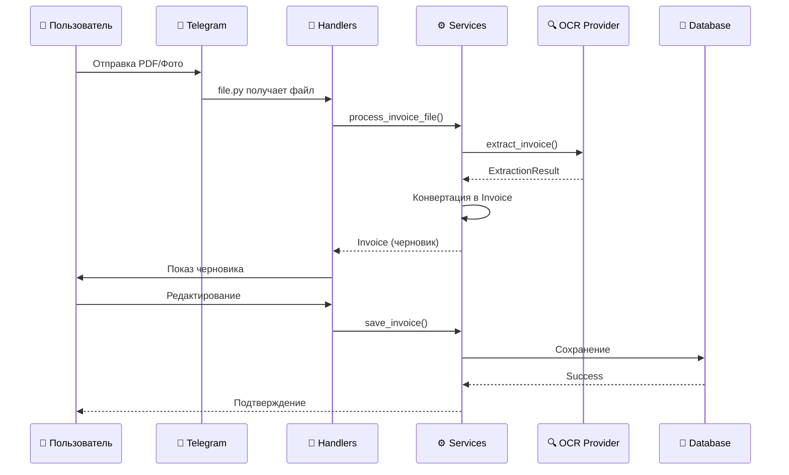
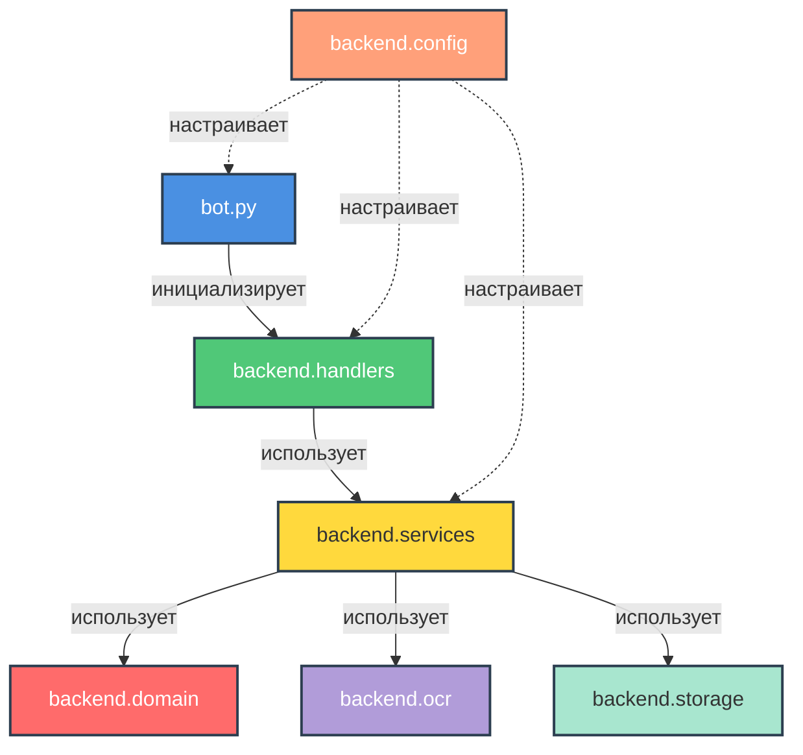

## 📋 Описание

InvoiceFlowBot работает как Telegram бот, принимающий документы от пользователя и обрабатывающий их через слой OCR:

- Пользователь отправляет боту PDF или фото счета, загружая файл прямо в чат.
- `backend.handlers.file` принимает вложение, валидирует формат и сохраняет временный файл.
- `backend.services.invoice_service` координирует вызовы OCR через `backend.ocr.engine.router` и конвертирует результаты в доменные сущности (`backend.domain.invoices`).
- Слой OCR реализован через абстракцию провайдеров: интерфейс `OcrProvider` и реализацию `MindeeOcrProvider`. Модуль `backend.ocr.engine.router` зависит только от интерфейса и вызывает текущий провайдер для распознавания счетов. В остальной части системы используется только функция `extract_invoice` из `backend.ocr.engine.router`.
- Полученный черновик сохраняется в памяти состояния (`backend.handlers.fsm`), а подтвержденные данные записываются в SQLite (`backend.storage.db`).
- Телеграм интерфейс (`backend.handlers.commands`, `backend.handlers.callbacks`, `backend.handlers.utils`) позволяет поправить поля, добавить комментарии и запросить историю.

## 🔄 Движение данных

### 📝 Детальные шаги

<table>
<tr>
<td width="5%" align="center">1️⃣</td>
<td>Пользователь отправляет PDF или изображение в бот</td>
</tr>
<tr>
<td width="5%" align="center">2️⃣</td>
<td><code>backend.handlers.file</code> получает файл и вызывает <code>backend.services.invoice_service.process_invoice_file()</code></td>
</tr>
<tr>
<td width="5%" align="center">3️⃣</td>
<td>Сервисный слой запускает <code>backend.ocr.engine.router</code> → <code>MindeeOcrProvider</code> → Mindee API</td>
</tr>
<tr>
<td width="5%" align="center">4️⃣</td>
<td><code>backend.services.invoice_service</code> конвертирует <code>ExtractionResult</code> в доменную <code>Invoice</code></td>
</tr>
<tr>
<td width="5%" align="center">5️⃣</td>
<td>Черновик сохраняется в памяти (<code>backend.handlers.fsm</code>), пользователь редактирует</td>
</tr>
<tr>
<td width="5%" align="center">6️⃣</td>
<td>Команда <code>/save</code> → <code>save_invoice()</code> → <code>backend.storage.db</code> → <code>data.sqlite</code></td>
</tr>
<tr>
<td width="5%" align="center">7️⃣</td>
<td>Команда <code>/invoices</code> → <code>list_invoices()</code> с фильтрацией</td>
</tr>
</table>

## 📁 Основные директории

### 🗂️ Структура модулей

| Модуль | Назначение | Ключевые файлы |
|--------|-----------|----------------|
| 🎯 **bot.py** | Точка входа | Регистрация хендлеров |
| ⚙️ **backend.config** | Конфигурация | `.env`, токены, Mindee |
| 🎨 **backend.domain/** | Доменная модель | Invoice, Header, Item |
| ⚡ **backend.services/** | Бизнес-логика | invoice_service.py |
| 🤖 **backend.handlers/** | Telegram обработка | file, commands, callbacks |
| 🔍 **backend.ocr/** | OCR провайдеры | engine, providers, mindee |
| 💾 **backend.storage/** | База данных | db.py, mappers |
| 🧪 **tests/** | Тестирование | Unit & integration |

<b>📦 Подробная структура handlers/</b>

- `file.py` — загрузка файлов и начальная обработка OCR
- `commands.py` — текстовые команды (/show, /edit, /invoices)
- `callbacks.py` — callback-запросы для inline-кнопок
- `utils.py` — утилиты форматирования и клавиатуры
- `state.py` — управление состоянием сессий

<b>🔍 Подробная структура backend.ocr/</b>

**providers/** — абстракция провайдеров:
- `base.py` — интерфейс `OcrProvider`
- `mindee_provider.py` — реализация для Mindee

**engine/** — движок OCR:
- `router.py` — маршрутизация к провайдерам
- `types.py` — типы данных
- `util.py` — утилиты

**Mindee интеграция:**
- `mindee_client.py` — прямая работа с Mindee API

